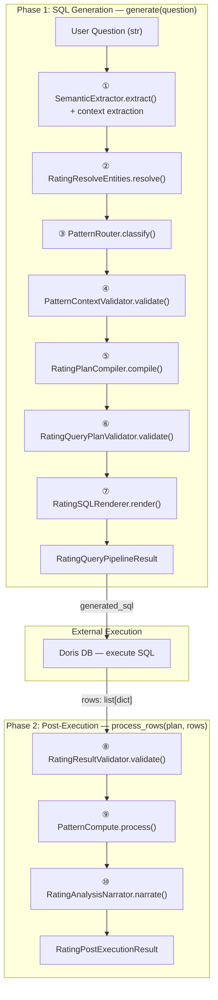
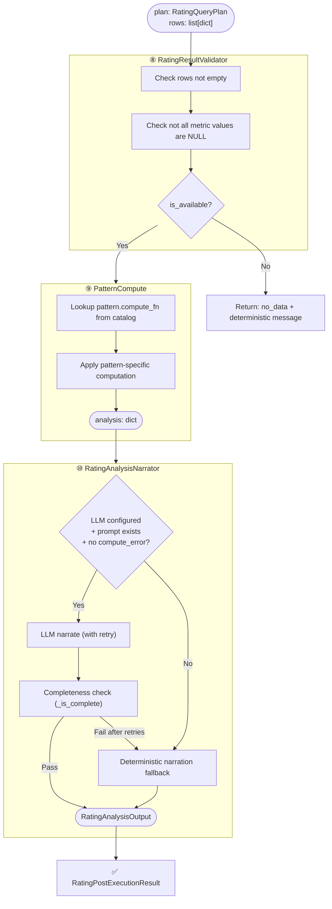
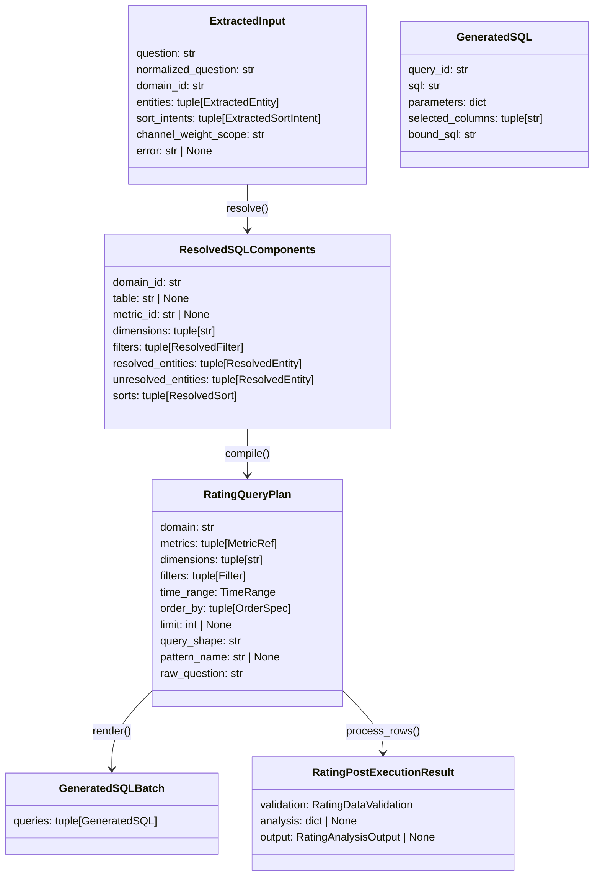
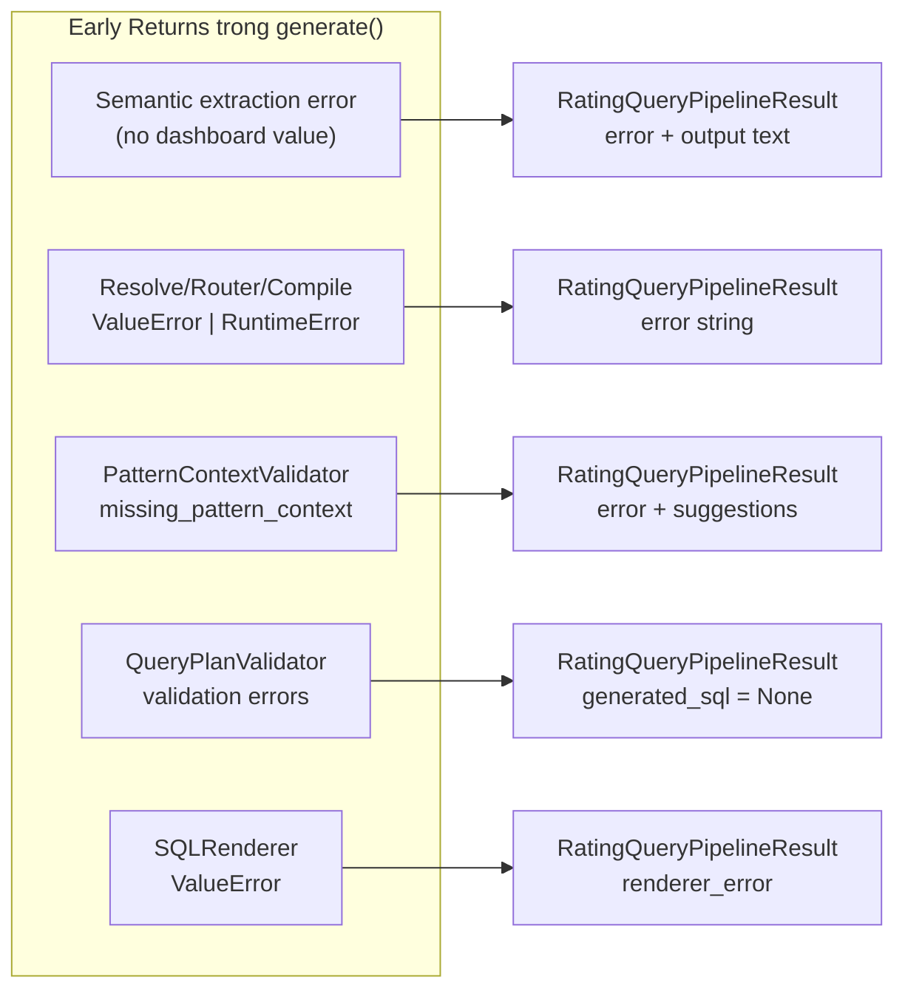

# Workflow: text_to_sql Pipeline

## 1. Tổng quan End-to-End

---

## 2. Phase 1 Chi Tiết — SQL Generation

```mermaid
flowchart TD
    START(["question: str"])

    subgraph S1["① Semantic extraction + context"]
        S1_1["LLM/rule semantic contract"]
        S1_2["Canonical raw dimensions and values"]
        S1_3["Extract time expressions (ISO, relative)"]
        S1_4["Extract limit (top N)"]
        S1_5["Extract sort intents (cao nhất, giảm dần...)"]
        S1_6["Detect channel_weight_scope"]
        S1_OUT(["ExtractedInput"])
    end

    START --> S1_1
    S1_1 --> S1_2 --> S1_3 --> S1_4 --> S1_5 --> S1_6 --> S1_OUT

    S1_OUT -->|"error != None"| ERR_EXTRACT["⛔ Return error result"]
    S1_OUT -->|"OK"| S2

    subgraph S2["② RatingResolveEntities"]
        S2_1["Resolve metric_term → metric_id"]
        S2_2["Resolve dimension_term → dimension_id"]
        S2_3["Resolve dimension_value → canonical_value + filter"]
        S2_4["Select compatible table via catalog.table_for()"]
        S2_5["Filter incompatible dimensions"]
        S2_6["Merge dimension filters (= / IN)"]
        S2_7["Resolve sort intents → ResolvedSort"]
        S2_OUT(["ResolvedSQLComponents"])
    end

    S2_1 --> S2_2 --> S2_3 --> S2_4 --> S2_5 --> S2_6 --> S2_7 --> S2_OUT

    S2_OUT --> S3

    subgraph S3["③ PatternRouter"]
        S3_1{"LLM configured?"}
        S3_2["LLM classify (prompt + semantic context)"]
        S3_3["Rule-based classify (catalog routing rules)"]
        S3_4["Parse + validate pattern name"]
        S3_5["Check _has_required_context()"]
        S3_OUT(["pattern_name: str"])
    end

    S3_1 -->|"Yes"| S3_2
    S3_2 --> S3_5
    S3_5 -->|"OK"| S3_OUT
    S3_5 -->|"Incompatible"| S3_3
    S3_1 -->|"No"| S3_3
    S3_3 --> S3_4 --> S3_OUT

    S3_OUT --> S4

    subgraph S4["④ PatternContextValidator"]
        S4_1["Check required_spec_fields (metric, dimensions, filters, limit)"]
        S4_2["Check time context (requires_explicit_time, minimum_time_buckets)"]
        S4_OUT{"is_valid?"}
    end

    S4_1 --> S4_2 --> S4_OUT
    S4_OUT -->|"No"| ERR_CONTEXT["⛔ Return missing_pattern_context + suggestions"]
    S4_OUT -->|"Yes"| S5

    subgraph S5["⑤ RatingPlanCompiler"]
        S5_1["Validate domain + unresolved entities"]
        S5_2["Resolve metric_ids (single or bundle)"]
        S5_3["CanonicalFilterBinder.plan_filters()"]
        S5_4["Build dimensions (group_filtered, time_dimension)"]
        S5_5["TimeResolver.resolve() → TimeRange"]
        S5_6["Compute limit (user / recipe / pattern default)"]
        S5_7["Compute order_by (explicit sorts / pattern defaults)"]
        S5_OUT(["RatingQueryPlan"])
    end

    S5_1 --> S5_2 --> S5_3 --> S5_4 --> S5_5 --> S5_6 --> S5_7 --> S5_OUT

    S5_OUT -->|"ValueError/RuntimeError"| ERR_COMPILE["⛔ Return compile error"]
    S5_OUT -->|"OK"| S6

    subgraph S6["⑥ RatingQueryPlanValidator"]
        S6_1["Validate query_shape + pattern"]
        S6_2["Validate metrics (active, recipe, join_profile)"]
        S6_3["Validate dimensions (group_by allowed, table compatible)"]
        S6_4["Validate order_by (field selected, direction valid)"]
        S6_5["Validate filters (filterable, dictionary, canonical values)"]
        S6_6["Validate limit range + shape constraints"]
        S6_OUT{"is_valid?"}
    end

    S6_1 --> S6_2 --> S6_3 --> S6_4 --> S6_5 --> S6_6 --> S6_OUT
    S6_OUT -->|"No"| ERR_VALIDATE["⛔ Return validation errors"]
    S6_OUT -->|"Yes"| S7

    subgraph S7["⑦ RatingSQLRenderer"]
        S7_1["Lookup table + metric from catalog"]
        S7_2["Dispatch recipe handler"]
        S7_3["Render SELECT + aggregate expressions"]
        S7_4["Render WHERE date >= :start AND date < :end"]
        S7_5["Render WHERE filters (named parameters)"]
        S7_6["Render GROUP BY / ORDER BY / LIMIT"]
        S7_7["Bind parameters → bound_sql"]
        S7_OUT(["GeneratedSQLBatch"])
    end

    S7_1 --> S7_2 --> S7_3 --> S7_4 --> S7_5 --> S7_6 --> S7_7 --> S7_OUT
    S7_OUT -->|"ValueError"| ERR_RENDER["⛔ Return renderer error"]
    S7_OUT -->|"OK"| FINAL["✅ RatingQueryPipelineResult (success)"]
```

---

## 3. Phase 2 Chi Tiết — Post-Execution

---

## 4. Data Contracts

---

## 5. Module Map

| # | Module | File | Input | Output | Vai trò |
|---|--------|------|-------|--------|---------|
| ① | `SemanticExtractor` + `QuestionContextExtractor` | [d_001_semantic_extraction.py](file:///d:/Work/repo/XBobo/src/core/text_to_sql/d_001_semantic_extraction.py) | `question: str` | `SemanticExtractionResult` + `ExtractedInput` | LLM/rule semantic extraction and deterministic time/limit/sort context |
| ② | `RatingResolveEntities` | [rating_resolver.py](file:///d:/Work/repo/XBobo/src/core/text_to_sql/rating_resolver.py) | `ExtractedInput` | `ResolvedSQLComponents` | Canonicalize entities, chọn table, build filters/sorts |
| ③ | `PatternRouter` | [pattern_router.py](file:///d:/Work/repo/XBobo/src/core/text_to_sql/pattern_router.py) | `ExtractedInput` + `ResolvedSQLComponents` | `pattern_name: str` | LLM/rule-based pattern classification |
| ④ | `PatternContextValidator` | [pattern_context_validator.py](file:///d:/Work/repo/XBobo/src/core/text_to_sql/pattern_context_validator.py) | `ExtractedInput` + `Components` + `pattern` | `PatternContextValidation` | Kiểm tra đủ context trước khi compile |
| ⑤ | `RatingPlanCompiler` | [rating_plan_compiler.py](file:///d:/Work/repo/XBobo/src/core/text_to_sql/rating_plan_compiler.py) | `ExtractedInput` + `Components` + `pattern` | `RatingQueryPlan` | Build query plan deterministic |
| ⑥ | `RatingQueryPlanValidator` | [rating_query_plan_validator.py](file:///d:/Work/repo/XBobo/src/core/text_to_sql/rating_query_plan_validator.py) | `RatingQueryPlan` | `ValidationResult` | Validate plan trước khi render SQL |
| ⑦ | `RatingSQLRenderer` | [rating_sql_renderer.py](file:///d:/Work/repo/XBobo/src/core/text_to_sql/rating_sql_renderer.py) | `RatingQueryPlan` | `GeneratedSQLBatch` | Render parameterized Doris SQL |
| ⑧ | `RatingResultValidator` | [rating_result_validator.py](file:///d:/Work/repo/XBobo/src/core/text_to_sql/rating_result_validator.py) | `RatingQueryPlan` + `rows` | `RatingDataValidation` | Kiểm tra data availability |
| ⑨ | `PatternCompute` | [pattern_compute.py](file:///d:/Work/repo/XBobo/src/core/text_to_sql/pattern_compute.py) | `RatingQueryPlan` + `rows` | `dict` (analysis) | Post-processing theo pattern |
| ⑩ | `RatingAnalysisNarrator` | [rating_analysis_narrator.py](file:///d:/Work/repo/XBobo/src/core/text_to_sql/rating_analysis_narrator.py) | `RatingQueryPlan` + `analysis` | `RatingAnalysisOutput` | LLM/deterministic narration |

---

## 6. Supporting Modules

| Module | File | Vai trò |
|--------|------|---------|
| `RatingCatalog` | [catalog.py](file:///d:/Work/repo/XBobo/src/core/text_to_sql/catalog.py) | Load YAML metadata: metrics, dimensions, tables, patterns, recipes |
| `RatingCatalog` | [catalog.py](file:///d:/Work/repo/XBobo/src/core/text_to_sql/catalog.py) | Semantic layer: table routing, metric expressions, dimensions, patterns and recipes |
| `RatingTimeResolver` | [time_resolver.py](file:///d:/Work/repo/XBobo/src/core/text_to_sql/time_resolver.py) | Resolve time phrases → `TimeRange [start, end)` |
| `CanonicalFilterBinder` | [canonical_filter_binder.py](file:///d:/Work/repo/XBobo/src/core/text_to_sql/canonical_filter_binder.py) | Convert `ResolvedFilter` → `Filter` (eq/in) |
| `PatternSpec` | [catalog_models.py](file:///d:/Work/repo/XBobo/src/core/text_to_sql/catalog_models.py) | Runtime pattern contract loaded by `RatingCatalog` |
| `RatingQueryPlan` | [query_plan.py](file:///d:/Work/repo/XBobo/src/core/text_to_sql/query_plan.py) | Data contracts: MetricRef, Filter, OrderSpec, TimeRange |
| `ResolvedSQLComponents` | [resolved_entities.py](file:///d:/Work/repo/XBobo/src/core/text_to_sql/resolved_entities.py) | Data contracts: ResolvedEntity, ResolvedFilter, ResolvedSort |

---

## 7. Luồng Lỗi (Error Flow)

> [!IMPORTANT]
> Pipeline hoàn toàn **deterministic** — không có LLM fallback, vector search, hay SQL execution trong Phase 1. LLM chỉ tham gia ở PatternRouter (optional classifier) và RatingAnalysisNarrator (optional narration) trong Phase 2.
