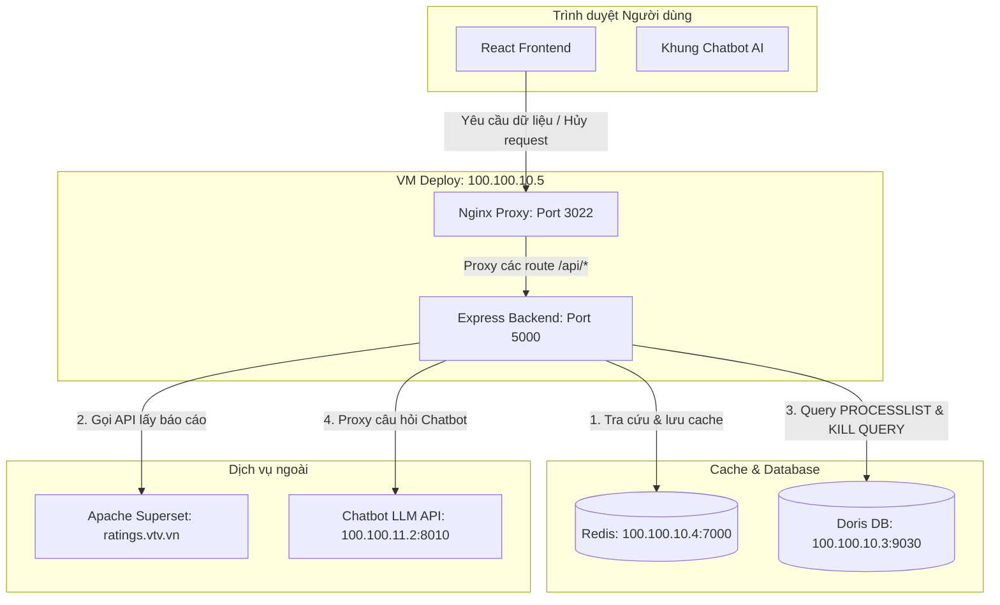

# TÀI LIỆU KỸ THUẬT HỆ THỐNG DASHBOARD WEB
**Technical Documentation | Version 1.0.0**

---

## Cover Page / Thông tin dự án

| Thuộc tính | Giá trị |
| :--- | :--- |
| **Project ID** | DASHBOARD WEB |
| **Version** | v1.0.0-node |
| **Organization** | The AMI Group |
| **Author** | Lê Văn Long |
| **Tech Stack** | React 19 (Vite) + Node.js (Express) + Redis + MySQL (Doris) + Apache Superset |
| **Workflow Status** | Production - Active |
| **Classification** | Internal - Confidential |
| **Availability** | Uptime: 99.9% |
| **Scale** | Queries Processed: 500k+/day |
| **Performance** | Latency: < 100ms (Cache hit), < 5s (Cache miss) |
| **Last Update** | 2026-08-20 |

---

## 1. MÔ TẢ TỔNG QUAN HỆ THỐNG

### 1.1 Giới thiệu
**Dashboard Web** là hệ thống nội bộ của **The AMI Group** tích hợp trực quan hóa báo cáo dữ liệu rating truyền hình và quảng cáo từ Apache Superset và cơ sở dữ liệu phân tích Doris. Hệ thống cung cấp khả năng truy vấn nhanh chóng, tối ưu hóa hiệu năng bằng bộ nhớ đệm Redis, điều phối tài nguyên bằng hàng đợi và hỗ trợ kiểm soát tài nguyên thông minh (cho phép người dùng hủy các truy vấn nặng đang chạy trên database Doris).

### 1.2 Vấn đề & Giải pháp
| Vấn đề | Giải pháp của Dashboard Web |
| :--- | :--- |
| **Tải báo cáo chậm** khi có nhiều người truy cập đồng thời hoặc gửi truy vấn trùng bộ lọc. | **Redis Caching**: Tích hợp Redis cache, chuẩn hóa cache key bằng cách loại bỏ `user_id` và sắp xếp đệ quy các filter key để tăng tỷ lệ dùng chung bộ nhớ đệm (cache hit rate). |
| **Nghẽn hàng đợi kết nối** của Apache Superset khi tải nhiều biểu đồ nặng cùng lúc. | **Queue Management (P-Queue)**: Phân chia làm 2 hàng đợi: *Normal Queue* (chạy song song tối đa 50 requests đồng thời) và *Heavy Queue* (chạy tuần tự từng request một) dựa trên đặc tính payload. |
| **Quá tải tài nguyên Doris DB** do các câu lệnh SQL phân tích nặng chạy ngầm quá lâu. | **Real-time Query Killing**: Hỗ trợ quét danh sách tiến trình (`PROCESSLIST`) trên Doris và chạy lệnh `KILL QUERY` trực tiếp trên database khi user chủ động hủy (cancel) request hoặc tắt tab. |
| **Session cookie & CSRF token** của Superset hết hạn làm gián đoạn API. | **Auto Authentication Retry**: Tự động đăng nhập, lấy session cookie/CSRF mới và tự động thực hiện lại request (retry) khi gặp lỗi xác thực 401 hoặc lỗi CSRF token. |
| **Hỏi đáp số liệu nhanh** chưa được hỗ trợ bằng ngôn ngữ tự nhiên. | **Chatbot AI Integration**: Tích hợp khung chat trực tuyến kết nối đến API query của LLM nội bộ. |

---

## 2. MỤC TIÊU SẢN PHẨM

### 2.1 KPI & Tiêu chí thành công
| Chỉ số KPI | Mục tiêu |
| :--- | :--- |
| **Tỷ lệ cache hit** | $\ge 70\%$ đối với các truy vấn có bộ lọc trùng nhau. |
| **Thời gian phản hồi (Latency)** | $< 100\text{ms}$ khi hit cache; $< 5\text{s}$ đối với các báo cáo thông thường chưa có cache. |
| **Độ chính xác tự động làm mới token** | $100\%$ các phiên làm việc được duy trì liên tục, không bị ngắt kết nối do hết hạn token. |
| **Tỷ lệ hủy query Doris** | $100\%$ các query tương ứng trên database được giải phóng ngay lập tức khi user nhấn hủy request. |
| **Uptime hệ thống** | $\ge 99.9\%$ hoạt động ổn định liên tục. |

---

## 3. KIẾN TRÚC HỆ THỐNG

### 3.1 Sơ đồ tổng quan



### 3.2 Luồng xử lý dữ liệu (Data Flow)
1. **Gửi yêu cầu**: React Frontend gửi request đến endpoint `/api/superset` chứa thông tin `url`, `payload` và mã định danh `user_id`.
2. **Xây dựng Cache Key**: Backend loại bỏ `user_id` ra khỏi payload, sắp xếp đệ quy tất cả các thuộc tính của payload và băm SHA-256 tạo thành cache key dạng `web_<hash>`. Điều này đảm bảo nhiều user khác nhau cùng chọn một bộ lọc sẽ dùng chung một cache key.
3. **Tra cứu Redis**: Backend tìm kiếm cache key trên Redis:
   - **Cache hit**: Trả kết quả ngay lập tức về cho Frontend.
   - **Cache miss**: Tiếp tục thực hiện các bước tiếp theo.
4. **Kiểm tra Xác thực**: Backend kiểm tra credentials của Apache Superset. Nếu chưa có hoặc hết hạn, tự động đăng nhập thông qua endpoint `/login/` để lấy CSRF token và session cookie mới.
5. **Điều phối Hàng đợi**: Đưa request vào hàng đợi bất đồng bộ `p-queue` tương ứng:
   - **Normal Queue**: Dành cho request thông thường (xử lý song song tối đa 50 requests cùng lúc).
   - **Heavy Queue**: Dành cho request nặng (xử lý tuần tự 1 request tại một thời điểm).
6. **Truy vấn Superset**: Gửi request API đến hệ thống Superset. Nếu nhận được lỗi 401 hoặc token không hợp lệ, backend tự động xóa credentials cũ, đăng nhập lại và thực hiện retry (tối đa 2 lần).
7. **Lưu trữ dữ liệu**: Nhận dữ liệu trả về từ Superset, gộp dữ liệu từ các query con (nếu có), lưu vào Redis cache với thời gian sống (TTL) mặc định là 3600 giây.
8. **Trả kết quả**: Trả dữ liệu sạch về cho Frontend để hiển thị lên giao diện.
9. **Hủy yêu cầu & Giải phóng tài nguyên (Kill Query)**: Khi người dùng nhấn nút Hủy truy vấn trên giao diện hoặc đóng trình duyệt:
   - Frontend gửi lệnh hủy qua `AbortController` của Axios đến backend Express.
   - Frontend gọi `/api/kill-user` để backend abort các request đang gọi sang Superset.
   - Backend kết nối tới Doris DB (`100.100.10.3:9030`), tìm các luồng truy vấn của `user_id` này trong bảng `information_schema.PROCESSLIST` và chạy câu lệnh `KILL QUERY '<query_id>'` để giải phóng bộ nhớ tức thì cho database.

### 3.3 Công nghệ & Triển khai (Tech Stack)
* **Frontend**: React 19, Vite, Tailwind CSS v4, Axios, Chart.js, ECharts.
* **Backend**: Node.js, Express, mysql2/promise, ioredis, node-fetch, cheerio, p-queue.
* **Cache**: Redis v7 (Port 7000) - Lưu trữ dữ liệu tạm thời.
* **Database**: Doris DB (MySQL compatible, Port 9030) - Lưu trữ và truy vấn dữ liệu ratings.
* **Security**: Session & CSRF Token Auto-rotation.
* **Deployment**: Docker & Nginx.

---

## 4. GIAO DIỆN HỆ THỐNG

### 4.1 Màn hình Rating Analysis (`/rating`)
- **Vai trò**: Phân tích số liệu Rating, Reach, Share của các chương trình và kênh truyền hình.
- **Tính năng**: 
  - Bộ lọc thông minh: Tỉnh/Thành phố, Kênh, Chương trình, Khung giờ, Đối tượng khán giả.
  - Hiển thị chỉ số KPI tổng quan (NumberCard, NumberWithTrendChart).
  - Trực quan hóa dữ liệu qua biểu đồ MixedChart (kết hợp cột và đường), BarChart, LineChart, TreeMap và bảng số liệu TableChart.

### 4.2 Màn hình Spot Analysis (`/spot`)
- **Vai trò**: Phân tích chi tiết các spot quảng cáo phát sóng trên các kênh.
- **Tính năng**:
  - Theo dõi tần suất, thời lượng phát sóng của quảng cáo.
  - Phân tích chi phí quảng cáo dự tính (spend VND) theo sản phẩm và nhãn hàng.

### 4.3 Màn hình Brand Analysis (`/brand`)
- **Vai trò**: Phân tích thị phần quảng cáo của thương hiệu và nhóm sản phẩm.
- **Tính năng**:
  - Trực quan hóa thị phần bằng biểu đồ hình tròn (PieChart) thể hiện SOS (Share of Voice - Tỷ lệ thời lượng) và SOV (Share of Value - Tỷ lệ giá trị).
  - So sánh chi tiết doanh số và tần suất quảng cáo giữa các thương hiệu đối thủ.

### 4.4 Màn hình World Cup 2026 (`/world-cup-2026`)
- **Vai trò**: Dashboard chuyên biệt phân tích hiệu quả ratings của chiến dịch phát sóng World Cup 2026.
- **Tính năng**:
  - Theo dõi rating thời gian thực của các trận đấu.
  - So sánh hiệu quả rating giữa các khung giờ phát sóng và các đối tượng khán giả đặc thù.

### 4.5 Khung Chatbot AI thông minh
- **Vai trò**: Hỗ trợ người dùng hỏi đáp nhanh về các chỉ số dữ liệu ratings bằng ngôn ngữ tự nhiên.
- **Tính năng**:
  - Tích hợp dưới dạng widget nổi ở góc phải màn hình.
  - Kết nối trực tiếp tới LLM API ở backend để tự động sinh câu truy vấn và trả lời kết quả cho người dùng.

---

## 5. BACKEND — Node.js / Express

### 5.1 Công nghệ & Cấu trúc
* **Ngôn ngữ**: Node.js (JavaScript ES6)
* **Framework**: Express
* **Database Client**: `mysql2/promise` (kết nối pool tới Doris DB)
* **Cache Client**: `ioredis` (kết nối Redis cluster/standalone)
* **HTTP Client**: `node-fetch` (truy xuất dữ liệu từ ratings.vtv.vn)
* **HTML Parser**: `cheerio` (phân tích trang login để lấy CSRF token)
* **Queue**: `p-queue` (kiểm soát số lượng request đồng thời gửi đến Superset)

### 5.2 API Endpoints chính
| Method | Endpoint | Mô tả |
| :--- | :--- | :--- |
| **POST** | `/api/superset` | Gateway chính nhận payload từ React, tạo cache key, kiểm tra Redis cache, điều phối hàng đợi và fetch dữ liệu báo cáo từ ratings.vtv.vn. |
| **POST** | `/api/doris/processlist` | Kiểm tra các query đang chạy trên Doris DB dựa trên `user_id` và thực hiện `KILL QUERY` để giải phóng tài nguyên. |
| **POST** | `/api/kill-user` | Hủy tất cả các request HTTP đang chạy (pending/running) của `user_id` cụ thể ở tầng backend. |
| **POST** | `/api/chatbot` | Nhận câu hỏi từ chatbot giao diện và proxy sang Chatbot LLM API (`http://100.100.11.2:8010/api/query`). |
| **GET** | `/api/health` | API kiểm tra sức khỏe hệ thống (Health Check). |

---

## 6. DATABASE & CACHE

### 6.1 Redis Cache
* **Host**: `100.100.10.4` | **Port**: `7000` | **DB**: `0`
* **Cơ chế Cache Key**:
  - Key được tạo theo công thức: `web_<SHA256(payload_normalized)>`
  - `payload_normalized`: Object payload đã loại bỏ `user_id` và các filter `user_id` lồng nhau, sau đó được sắp xếp thứ tự các thuộc tính (Deep Sort) rồi chuyển thành chuỗi JSON.
  - **TTL (Time to Live)**: Mặc định `3600` giây (1 giờ). Cấu hình qua biến môi trường `REDIS_TTL`.

### 6.2 MySQL (Doris Database)
* **Host**: `100.100.10.3` | **Port**: `9030` | **User**: `Ami_doris`
* **Bảng theo dõi tiến trình**: `information_schema.PROCESSLIST`
* **Lệnh hủy truy vấn**:
  ```sql
  -- Lấy danh sách query ID của user
  SELECT QUERY_ID, Info FROM information_schema.PROCESSLIST WHERE COMMAND = 'Query' AND Info LIKE '%<user_id>%';
  
  -- Thực hiện kill query
  KILL QUERY '<query_id>';
  ```

---

## 7. TRIỂN KHAI & CẤU HÌNH (DEPLOYMENT & CONFIGURATION)

### 7.1 Môi trường
* **Server**: VM Cloud
* **Địa chỉ IP Deploy**: `100.100.10.5`
* **Cổng Frontend (Port)**: `3022` (Chạy Docker container Nginx phục vụ code React build tĩnh)
* **Cổng Backend (Port)**: `5000` (Chạy Docker container Node.js Express)
* **Redis Cache**: `100.100.10.4:7000`
* **Doris DB**: `100.100.10.3:9030`
* **Chatbot Service**: `100.100.11.2:8010`
* **Apache Superset**: `https://ratings.vtv.vn`

### 7.2 Biến môi trường (env)

#### Backend (`/backend_superset/.env`)
```env
# Superset Config
SUPERSET_URL=https://ratings.vtv.vn
SUPERSET_USERNAME=Long
SUPERSET_PASSWORD=Longouttrinh

# Server Config
PORT=5000
NODE_ENV=production

# Redis Config
REDIS_HOST=100.100.10.4
REDIS_PORT=7000
REDIS_TTL=3600
REDIS_DB=0
```

#### Frontend (`/frontend/.env`)
```env
VITE_API_BASE_URL=http://100.100.10.5:5000
VITE_API_TIMEOUT=300000
VITE_API_ROUTE=/api/superset
VITE_API_DOMAIN=https://ratings.vtv.vn
```

---
**HẾT TÀI LIỆU**
